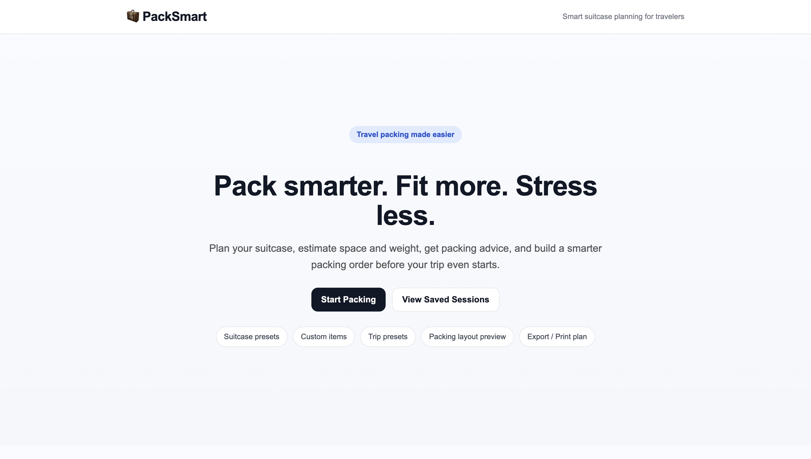
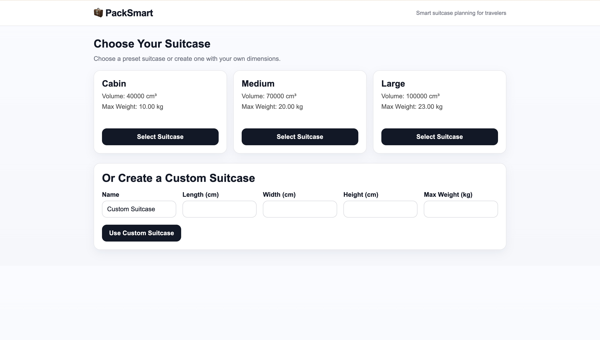
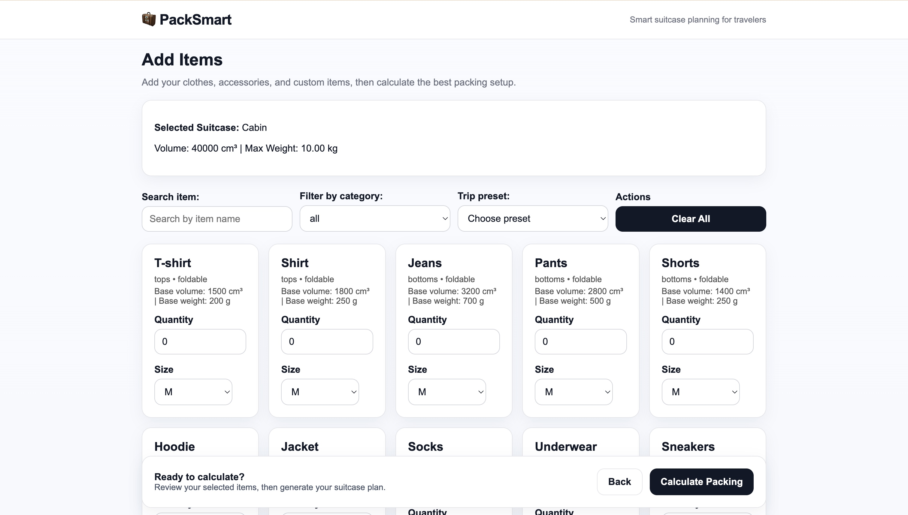
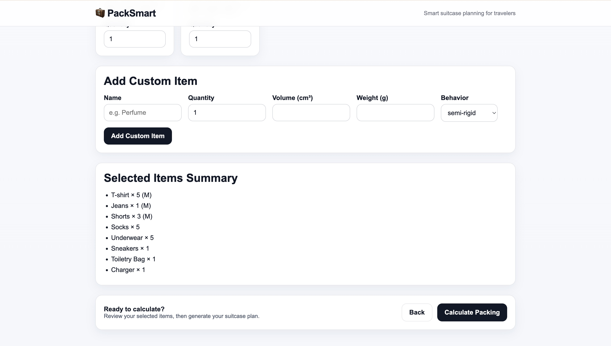
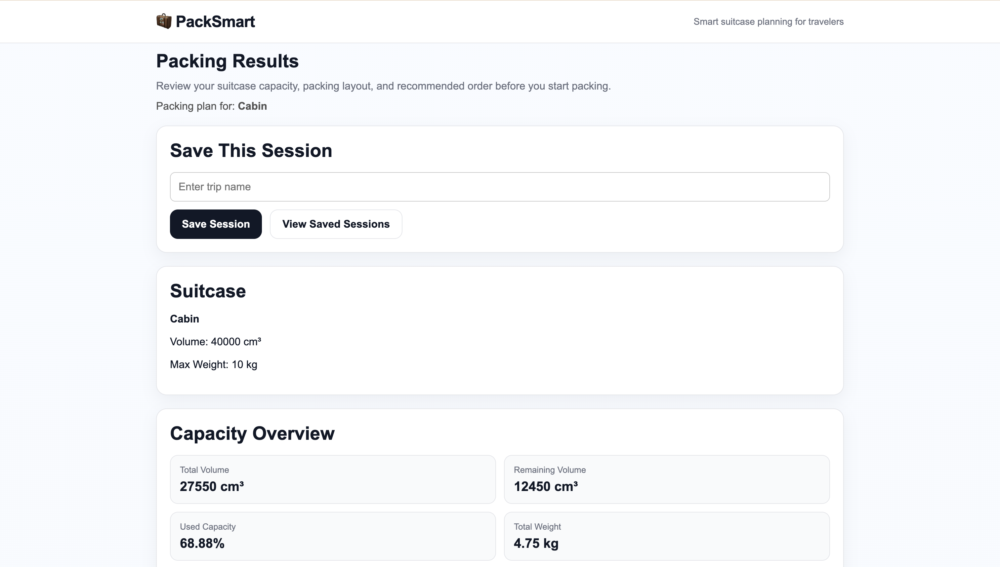
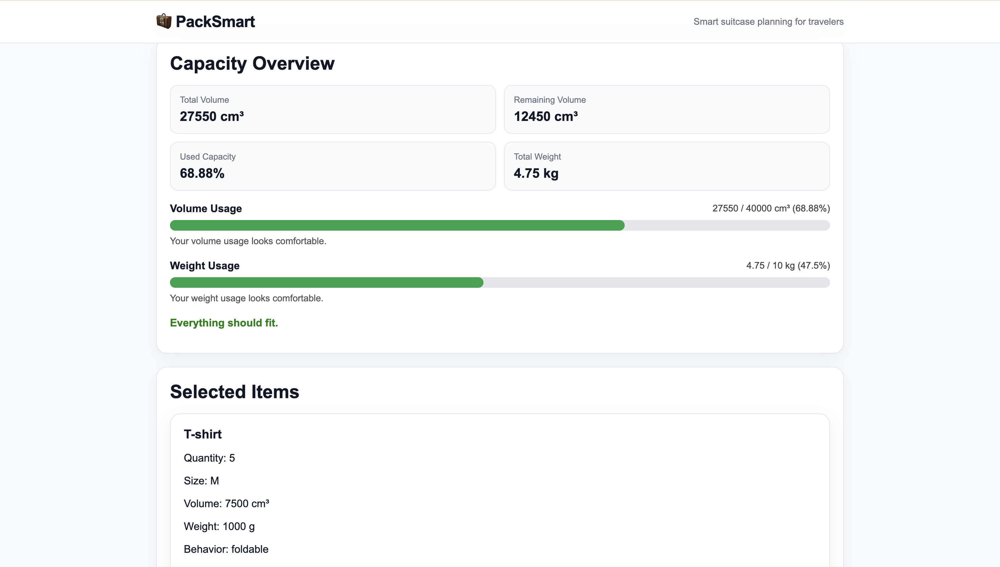
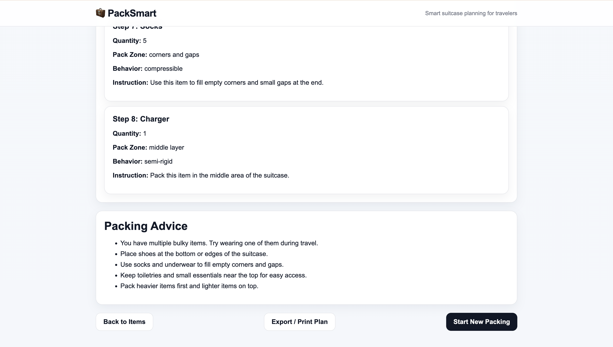
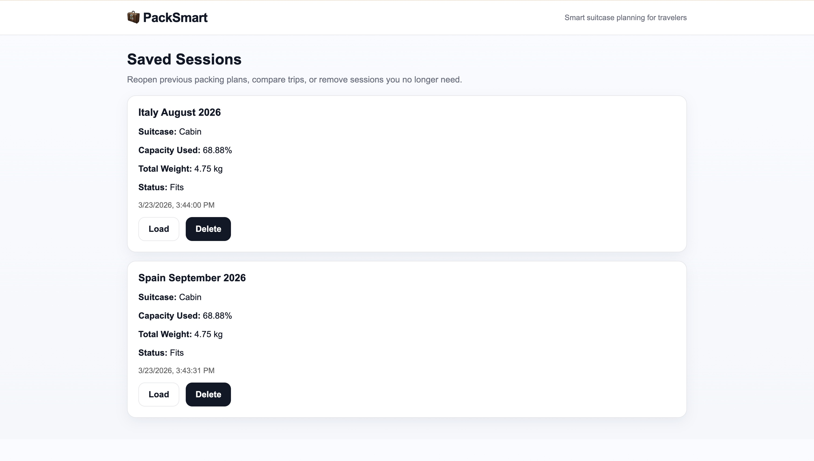

# 🧳 PackSmart

**Smart suitcase planning for modern travelers.**

PackSmart is a full-stack web application that helps users plan their luggage efficiently by estimating suitcase capacity, managing weight and volume, and generating a practical packing plan.

---

## ✨ Features

### 🧳 Suitcase Management

* Choose from preset suitcase types
* Create custom suitcases with dimensions
* Automatic volume calculation

### 📦 Item Management

* Predefined travel items
* Size-based variations
* Custom item support
* Search and category filtering

### ✈️ Trip Presets

Quick-start packing with:

* Weekend Trip
* 5-Day Summer Trip
* 7-Day Winter Trip
* Business Trip

### 📊 Smart Calculations

* Total volume & weight
* Remaining capacity
* Fit / not fit estimation
* Capacity progress indicators

### 🧠 Smart Packing Assistance

* Packing advice
* Recommended packing order
* Simple suitcase layout preview

### 💾 Session Management

* Save packing sessions (localStorage)
* Load & delete previous plans

### 📄 Export

* Export packing plan via browser print (PDF)

---

## 🚀 How It Works

1. **Select a Suitcase**
   Choose a preset or define your own dimensions and weight limits.

2. **Add Items**

   * Select from predefined items
   * Adjust quantity and size
   * Add custom items

3. **Apply Trip Preset (Optional)**
   Automatically populate recommended items based on trip type.

4. **Calculate Packing**
   The backend calculates:

   * Total volume used
   * Total weight
   * Remaining capacity
   * Fit / not fit result

5. **View Packing Plan**
   Get:

   * Packing summary
   * Smart advice
   * Packing order
   * Layout preview

---

## 🛠 Tech Stack

### Frontend

* React
* React Router
* Axios
* CSS

### Backend

* Node.js
* Express.js

### Database

* MySQL

### Storage

* localStorage (sessions & temporary state)

---

## 📁 Project Structure

```
packsmart/
  client/        # React frontend
    src/
      components/
      pages/
      services/
      styles/

  server/        # Node.js backend
    config/
    controllers/
    routes/
```

---

## ⚙️ Getting Started

### 1. Clone the repository

```bash
git clone https://github.com/georgesakran/packsmart.git
cd packsmart
```

---

### 2. Setup Backend

```bash
cd server
npm install
npm run dev
```

Create a `.env` file in `/server`:

```
DB_HOST=127.0.0.1
DB_USER=root
DB_PASS=your_password
DB_NAME=packsmart_db
PORT=5000
```

---

### 3. Setup Frontend

```bash
cd client
npm install
npm start
```

---

## 🎯 Future Improvements

* User authentication (JWT)
* Cloud database integration
* Advanced 3D suitcase visualization
* AI-based packing recommendations
* Mobile app version

---

## 📌 Notes

* Make sure MySQL is running locally
* Ensure the database `packsmart_db` is created and imported
* `.env` files are not included in the repository

---

## 👨‍💻 Author

**George Sakran**

---

## 📄 License

This project is open-source and available for learning and development purposes.


## 📸 Screenshots

### 🏠 Home Page



### 🧳 Suitcase Selection



### 📦 Items Page




### 📊 Results Page






### 💾 Saved Sessions



